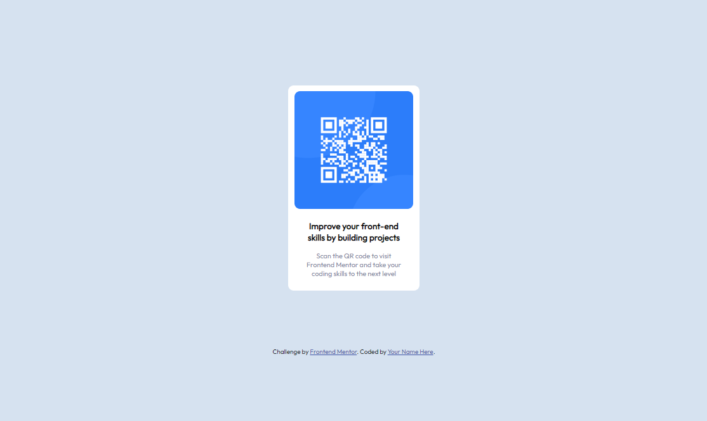
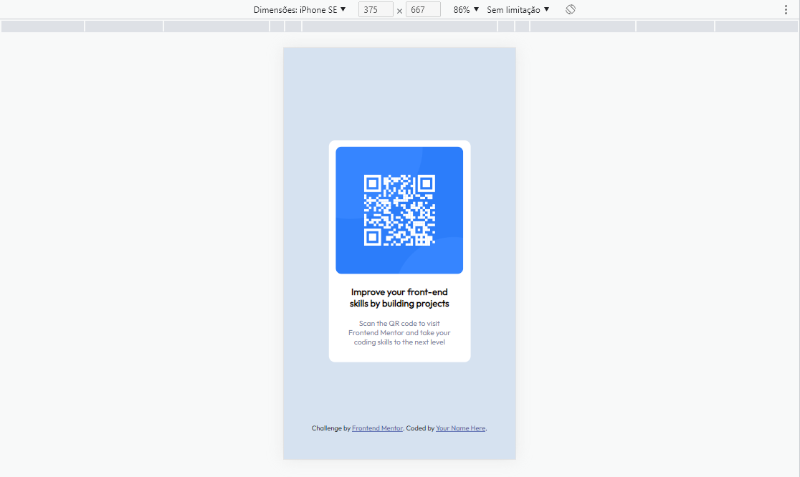

# Frontend Mentor - solução de componente de código QR

Esta é uma solução para o [desafio do componente de código QR no Frontend Mentor](https://www.frontendmentor.io/challenges/qr-code-component-iux_sIO_H). Os desafios do Frontend Mentor ajudam você a melhorar suas habilidades de codificação criando projetos realistas.

## Tecnologias utilizadas
- HTML
- CSS

## Dificuldades
Realizar a centralização dos elementos e por a borda no card e img, mas com uma olhada nos resumos e uma ajuda na classificação, deu tudo certo.

## Gratificação
Fiquei muito feliz em conseguir fazer o projete, idealizar a lógica de como seria feito
